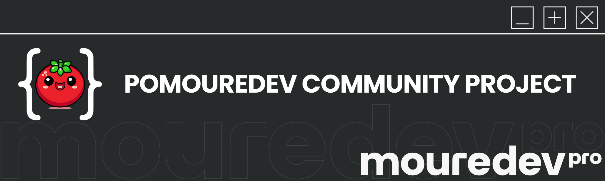
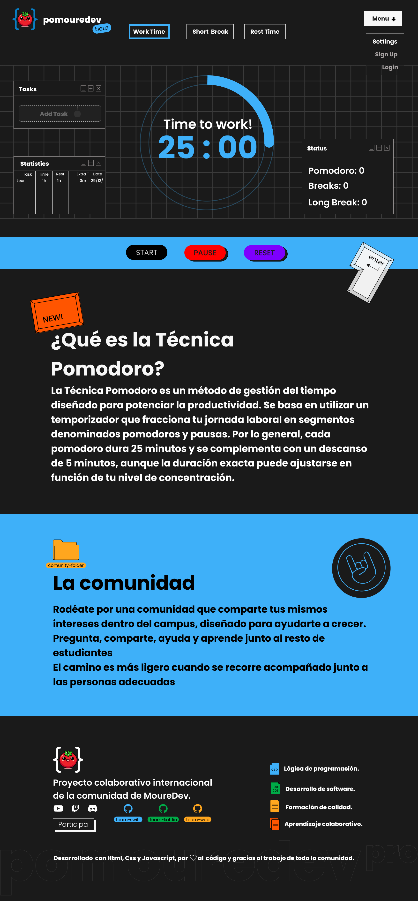

 
# Proyecto Pomodoro Web  
Proyecto colaborativo de la comunidad **MoureDev**  

---

## #️⃣ Descripción del Proyecto  
Este proyecto colaborativo tiene como objetivo desarrollar una **aplicación web Pomodoro** para gestionar el tiempo de manera eficiente, mejorando la productividad y la concentración mediante la técnica Pomodoro.  

Utilizaremos **HTML**, **CSS** y **JavaScript** como tecnologías base, fomentando el aprendizaje continuo y la colaboración entre desarrolladores de distintos niveles de experiencia, a nivel internacional.  

---

## ❓ ¿Qué es la Técnica Pomodoro?  
La **técnica Pomodoro** es un método de gestión del tiempo que divide el trabajo en bloques de **25 minutos de trabajo intenso**, seguidos de **descansos cortos de 5 minutos**. Después de **4 Pomodoros**, se recomienda tomar un descanso más largo de **15 a 30 minutos** para recargar energías.  

Esta técnica es ideal para mejorar la productividad y mantener un equilibrio entre trabajo y descanso.

---

## 🚀 Objetivo del Proyecto  
Crear una **aplicación web interactiva** que permita a los usuarios gestionar su tiempo utilizando la técnica Pomodoro, con funcionalidades clave como:  

- ✅ Temporizador Pomodoro interactivo.  
- 📊 Visualización de métricas y estadísticas de productividad.  
- 📝 Gestión de tareas y hábitos (en futuras iteraciones).  

---

## 🛠️ Tecnologías y Herramientas Utilizadas  
- **HTML5**: Para la estructura del contenido.  
- **CSS3**: Para los estilos visuales, diseño y disposición.  
- **JavaScript**: Para la funcionalidad interactiva (temporizador, botones, etc.).  

---

## 🎨 Diseño del Proyecto  
Dado que todos los colaboradores somos parte de la comunidad de **Brais Moure (@mouredev)**, decidimos emular el estilo visual de la página [MoureDev Pro](https://mouredev.pro/) para mantener coherencia y profesionalismo en el diseño.  

El diseño del proyecto está disponible en **Figma**:  
🔗 [Figma Design](https://www.figma.com/design/EpLTpcJeaTzadVa837k7Fg/Untitled?node-id=1-2&t=NL8yOo005ZTLetNr-1).  

📸 **Vista Previa del Diseño**:  
  

---

## 👩‍💻 ¿Quiénes Pueden Participar?  
Este proyecto es **abierto a todos los niveles de experiencia**. ¡Todos son bienvenidos!  

- 🐣 **Principiantes**: Una gran oportunidad para aprender los fundamentos de desarrollo web y trabajar en equipo.  
- 🧑‍💻 **Intermedios**: Profundiza tus conocimientos en **JavaScript** y prácticas avanzadas de **CSS**.  
- 🦸‍♂️ **Avanzados**: Guía y ayuda a otros desarrolladores en el proyecto, revisando código y proponiendo mejoras.  

---

## ⁉️ ¿Cómo contribuir?
  1️⃣ **Clona el repositorio** y familiarízate con los archivos existentes:        

        git clone https://github.com/ProyectosWebComunidadMoureDev/PomodoroWeb    
  2️⃣ **Contribuye** creando nuevas funcionalidades, mejorando el diseño o refactorizando el código.
  3️⃣ Confirma y sube tus cambios:

        git commit -m "Descripción breve del cambio"
  4️⃣ Abre un Pull Request para revisión.
    
  5️⃣ **Explora las issues** en la sección correspondiente. Busca algo interesante para empezar o crea tu propia issue si detectas algo que mejorar.

## 📄 Licencia

Este proyecto está licenciado bajo la Licencia MIT. Consulta el archivo [LICENSE](LICENSE) para más detalles.

## Organización del Trabajo
  ### 📁 Carpetas y Archivos
  - `index.html`: Archivo principal del proyecto.
  - `style.css`: Estilos de la página.
  - `script.js`: Funciones y lógica del temporizador.

  ### 📋 Desarrollo por Fases
  - **Fase 1**: Maquetación básica con HTML y CSS.
  - **Fase 2**: Lógica del temporizador en JavaScript.
  - **Fase 3**: Mejoras y personalización (ejemplo: añadir sonidos o estadísticas).

## 📌 Recursos Adicionales
- [Documentación de HTML](https://developer.mozilla.org/es/docs/Web/HTML)
- [Documentación de CSS](https://developer.mozilla.org/es/docs/Web/CSS)
- [Documentación de JavaScript](https://developer.mozilla.org/es/docs/Web/JavaScript)

## 🌐 Proyectos Paralelos
Este proyecto está acompañado por dos desarrollos paralelos que comparten la misma funcionalidad básica, pero en diferentes plataformas:

- [Proyecto Swift](https://github.com/kontroldev/Proyecto_1_Pomodoro)
- [Proyecto Kotlin](https://github.com/juanppdev/Proyecto_1_Pomodoro)  
---
### ¡Colaboremos, aprendamos y divirtámonos desarrollando juntos! 🚀
¡Gracias por contribuir y formar parte de este proyecto! 💪
